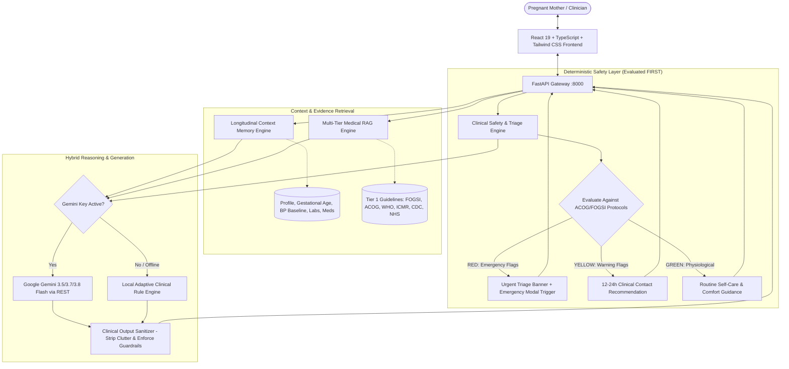

# MOMENT — Personalized Evidence-Grounded AI Pregnancy Companion
<<<<<<< HEAD

[](https://fastapi.tiangolo.com)
[](https://react.dev/)
[](https://www.typescriptlang.org/)
[](https://tailwindcss.com/)
[](https://ai.google.dev/)
[](https://python.org)

> **"An intelligent, evidence-grounded AI pregnancy companion that maintains a persistent longitudinal memory of the mother's journey, evaluates symptoms through deterministic clinical safety protocols, tracks medications and wearable vitals, and bridges the gap to professional obstetric care."**
=======
Delpoyed:https://mo-ment-flame.vercel.app/
> **"An AI pregnancy companion that remembers the pregnancy journey, uses trusted medical evidence, tracks care/medications/health data, and safely connects the user to professional care when needed."**
>>>>>>> e4bd735a47b767eb57819a368846d750dbf557d8

---

## 📑 Table of Contents

- [The Problem with Generic AI in Maternal Care](#-the-problem-with-generic-ai-in-maternal-care)
- [How MOMENT Works (Under the Hood)](#-how-moment-works-under-the-hood)
  - [1. Longitudinal Context Memory](#1-longitudinal-context-memory-no-amnesia)
  - [2. Deterministic Safety & Triage Engine](#2-deterministic-clinical-safety-triage-engine-no-llm-only-emergencies)
  - [3. Multi-Tier Medical RAG & Vector Retrieval](#3-multi-tier-medical-rag--vector-retrieval)
  - [4. Dual-Engine LLM: Google Gemini + Local Fallback](#4-dual-engine-llm-google-gemini--local-clinical-engine)
  - [5. Human-in-the-Loop OCR Medical Report Parser](#5-human-in-the-loop-ocr-medical-report-parser)
  - [6. "Since Your Last Visit" Clinical Doctor Summary](#6-since-your-last-visit-clinical-doctor-summary)
  - [7. 24/7 Maternity Emergency Triage & Geo-Locator](#7-247-maternity-emergency-triage--geo-locator)
  - [8. Pregnancy Food Safety & Pathogen Engine](#8-pregnancy-food-safety--pathogen-engine)
  - [9. Wearable HealthKit & Vitals Adapter](#9-wearable-healthkit--vitals-adapter)
- [System Architecture](#-system-architecture)
- [Comprehensive Feature Overview](#-comprehensive-feature-overview)
- [Clinical Validation & Patient Journey Simulation](#-clinical-validation--patient-journey-simulation)
- [Project Directory Structure](#-project-directory-structure)
- [REST API Reference](#-rest-api-reference)
- [Local Development & Quick Start](#-local-development--quick-start)
- [Deployment Guide](#-deployment-guide)
- [Clinical Safety & Guardrail Principles](#-clinical-safety--guardrail-principles)

---

## 🚨 The Problem with Generic AI in Maternal Care

Generic conversational AI models (e.g., standard ChatGPT, generic search bots) pose significant risks when applied to prenatal health:

1. **Amnesia (Session Isolation):** Generic AI treats every message as a clean slate. If a mother was diagnosed with mild gestational hypertension at Week 27 and is prescribed Labetalol, a generic bot evaluating an evening headache at Week 31 will address it as a generic tension headache—failing to connect the symptom to maternal hypertensive history and preeclampsia risks.
2. **Hallucination & Anecdotal Open-Web Content:** Generic LLMs pull uncritically from unmoderated internet forums, confusing lay anecdotes with peer-reviewed maternal-fetal medicine consensus.
3. **Dangerous Medical Overreach:** Generic chatbots often attempt to diagnose conditions or inappropriately suggest modifying prescription drug dosages.
4. **Lack of Clinical Handoff:** Chatbots do not prepare structured handoffs or clinical summaries for the obstetrician, leaving consultations disjointed.

### The MOMENT Solution:
MOMENT was built from the ground up as a **clinically constrained, evidence-grounded companion** that pairs high-level generative AI with deterministic clinical triage protocols, longitudinal memory, and structured doctor handoffs.

---

## 🧠 How MOMENT Works (Under the Hood)



---

### 1. Longitudinal Context Memory (No Amnesia)
Unlike transient chatbots, MOMENT maintains a structured, persistent longitudinal profile for each mother.
- **Dynamic Gestational Tracking:** Accurate tracking of gestational age (weeks + days), trimester progression, and estimated delivery dates.
- **Clinical Baseline History:** Records pre-existing or pregnancy-induced conditions (e.g., *Mild Gestational Hypertension diagnosed at Week 27*), allergies (*Penicillin*), and blood type (*O+ Rh+*).
- **Cumulative Timeline:** Ingests scans (Week 12 Nuchal Translucency, Week 20 Anatomy Scan, Week 28 Growth Biometry), lab panels (1-Hour Glucose Challenge, Complete Blood Count, Urine Protein/Creatinine ratio), and clinic notes.
- **Context Injection:** When a question is submitted, MOMENT injects the patient's full longitudinal clinical profile into the reasoning context before formulating a response.

### 2. Deterministic Clinical Safety Triage Engine (No LLM-Only Emergencies)
Emergency obstetric decisions must **never** depend solely on non-deterministic LLM tokens. MOMENT runs an algorithmic clinical triage engine based on:
- **ACOG Practice Bulletin #222 & FOGSI:** Gestational Hypertension & Preeclampsia with severe features.
- **ACOG Practice Bulletin #171:** Management of Preterm Labor & Contraction Intervals.
- **CDC 'Hear Her' Campaign:** Urgent maternal warning signs.
- **WHO Antenatal Guidelines & NHS Green-top:** Reduced fetal movements (Cardiff Count-to-Ten protocol) and antepartum hemorrhage.

#### Triage Classification System:

| Safety Level | Clinical Action Guidance | Protocol Source |
| :--- | :--- | :--- |
| 🟢 **GREEN** | Expected third-trimester physiological symptoms (e.g. mild backache, standard fatigue, isolated dependent edema, practice Braxton-Hicks). Comfort measures and routine monitoring. | WHO Antenatal Care Recommendations |
| 🟡 **YELLOW** | Non-emergent symptom requiring clinical review within **12–24 hours** (e.g., mild tension headache in hypertensive patient, suspected UTI symptoms, persistent nausea). | CDC 'Hear Her' Campaign & NHS Pathways |
| 🔴 **RED** | **Immediate emergency obstetric evaluation required.** Automatically activates the RED urgency banner, directs user to the 24/7 Emergency Care modal, and arms 1-click calls for doctor, hospital triage, and emergency dispatch. | ACOG PB #171 (Preterm Labor) & ACOG PB #222 (Preeclampsia) |

#### Zero Dosage Titration Guardrail:
If a user asks whether they should modify their prescription dosage (e.g., *"My blood pressure is 134/84, should I increase my Labetalol to 200mg?"*), MOMENT triggers a strict deterministic refusal:
> *"Prescription antihypertensive medications like Labetalol must only be adjusted by your supervising obstetrician (Dr. Priya Raman). Never independently titrate medication doses."*

---

### 3. Multi-Tier Medical RAG & Vector Retrieval
MOMENT uses an evidence hierarchy to filter out internet noise:
- **Tier 1 (Authoritative Clinical Bodies):** FOGSI (Federation of Obstetric and Gynaecological Societies of India), ACOG, ICMR (Indian Council of Medical Research), WHO, CDC, NHS.
- **Tier 2 (Academic Reference):** Peer-reviewed maternal-fetal literature, UpToDate summaries, Mayo Clinic guidelines.
- **Tier 3 (Supervised Clinical Q&A):** Clinician-validated common queries.

The RAG engine uses TF-IDF vectorization with cosine similarity scoring, topic-boosted keyword weighting, and gestational-age filtering to pull top clinical citations into the reasoning pipeline.

---

### 4. Dual-Engine LLM: Google Gemini + Local Clinical Engine
MOMENT is built for both high-end cloud intelligence and reliable offline availability:
- **Google Gemini Integration:** Connects to `gemini-3.5-flash`, `gemini-3.7-flash`, or `gemini-3.8-flash` via HTTPX with system instructions enforcing obstetric tone, medium-length brevity (120–180 words), evidence citations, and strict safety guardrails.
- **In-App API Key Manager:** Users or judges can configure and test their Gemini API key directly through the UI (**AI Settings Modal**) without touching server config files or restarting processes.
- **Built-in Local Clinical Engine:** If no Gemini key is provided, MOMENT gracefully falls back to a deterministic, rule-based clinical engine that provides comprehensive, evidence-grounded answers without crashing.
- **Clinical Output Sanitizer:** Cleans out hashtag headers (`###`), excessive bolding, and markdown clutter to produce clean, doctor-like conversational text.

---

### 5. Human-in-the-Loop OCR Medical Report Parser
When mothers upload lab reports, ultrasounds, or prescriptions (PDF, PNG, JPG), automatic ingestion without verification is dangerous. MOMENT enforces a **Human-in-the-Loop verification step**:
1. Ingests ultrasound biometry (`BPD`, `HC`, `AC`, `FL`, `EFW`, `AFI`, `Doppler S/D`) or lab values (`1-hr Glucose`, `Hemoglobin`, `Platelets`, `Urine Protein/Creatinine`).
2. Extracts and displays all parameters in a structured pre-save confirmation modal:
   > **"We extracted the following information. Please verify before saving."**
3. The patient or clinician reviews, edits if necessary, and explicitly confirms the data before it enters the longitudinal timeline.

---

### 6. "Since Your Last Visit" Clinical Doctor Summary
Prenatal appointments are often rushed (10–15 minutes). MOMENT generates a structured, exportable clinical handoff document:
- **Patient Overview:** Current gestational age, maternal age, gravidity/parity, and active risk conditions.
- **Symptom Interval Log:** Complete list of symptoms experienced since the last visit with severity (1–10), onset, frequency, and triage ratings.
- **Medication Adherence Rate:** Calculated compliance percentage (e.g. `94% adherence`) and specific missed dose logs.
- **Vitals & Health Trends:** Average daily steps, sleep duration, resting heart rate curves, and maternal weight gain trajectory.
- **Recent Scan & Lab Findings:** Highlighting normal vs flagged values.
- **Suggested Questions for the Obstetrician:** Intelligent, personalized questions generated specifically for Dr. Priya Raman based on the patient's data.

---

### 7. 24/7 Maternity Emergency Triage & Geo-Locator
When emergency red flags are detected, instant action is critical:
- **1-Click Emergency Calling:** Direct call buttons for:
  - Emergency Dispatch (`112` / `108` in India, `911` fallback)
  - Personal Obstetrician (Dr. Priya Raman)
  - Hospital 24/7 Labor & Delivery Triage Line
- **Live GPS Distance Calculation:** Uses the Haversine formula to compute exact driving distances to nearby accredited maternal care centers.
- **Dynamic Facility Lookup:** If the user is outside the primary metro area, MOMENT queries OpenStreetMap (OSM) Nominatim to dynamically fetch real nearby emergency hospitals.
- **NICU & Maternal Level Indicators:** Highlights Level III and Level IV Maternal-Fetal ICUs and NICUs.

---

### 8. Pregnancy Food Safety & Pathogen Engine
Evaluates food queries against FDA, CDC, ICMR-NIN, and FSSAI standards:
- **Pathogen Vector Analysis:** Identifies risks for *Listeria monocytogenes, Salmonella enterica, Toxoplasma gondii, Methylmercury*, and *Hepatitis E*.
- **Classification:** Clearly tags items as `SAFE`, `CAUTION`, `AVOID`, or `ASK OB-GYN`.
- **Cultural & Regional Adaptation:** Handles Indian and international queries (e.g., raw vs ripe yellow papaya, pasteurized paneer, tender coconut water, saffron in warm milk, street pani puri, sushi, soft cheeses).

---

### 9. Wearable HealthKit & Vitals Adapter
Architected with an extensible **`HealthDataProvider`** abstract base pattern:
- **`MockHealthKitProvider`:** High-fidelity simulation of Apple HealthKit and Android Health Connect streams.
- **Third-Trimester Physiological Shifts:** Simulates realistic clinical shifts—maternal blood volume expansion causing elevated resting heart rate (78–82 bpm), sleep fragmentation (frequent nighttime wakings), and step counts.
- **Extensible Architecture:** Ready for native iOS HealthKit and Android Health Connect production adapters.

---

## 🏛️ System Architecture

```mermaid
graph LR
    subgraph Frontend["Frontend Layer (React 19 + TypeScript + Vite)"]
        UI_Dash[Dashboard Hero & Gestational Age]
        UI_Chat[AI Companion Modal]
        UI_Triage[Symptom Triage Modal]
        UI_Summary[Doctor Summary Handoff]
        UI_Emerg[Emergency Hub & GPS Hospital Locator]
        UI_Reports[OCR Report Parser & Timeline]
        UI_Food[Food Safety Checker]
        UI_Settings[AI Settings & Gemini Key Manager]
    end

    subgraph Backend["Backend Gateway (FastAPI Python 3.10+)"]
        API_Context["/api/context"]
        API_Chat["/api/chat"]
        API_Triage["/api/symptoms/triage"]
        API_Emerg["/api/emergency/hospitals"]
        API_OCR["/api/reports/ocr-parse"]
        API_Summary["/api/doctor-summary"]
        API_Food["/api/food/check"]
        API_Settings["/api/settings/gemini-key"]
    end

    subgraph CoreServices["Clinical Logic Services"]
        MemoryService[Longitudinal Context Store]
        SafetyService[Deterministic Safety Engine]
        RAGService[TF-IDF Multi-Tier RAG Engine]
        GeminiService[Google Gemini Integration]
        OCRService[Document Parser & Biometry Extractor]
        HealthService[HealthDataProvider Adapter]
    end

    Frontend <--> Backend
    Backend <--> CoreServices
```



---

## 🌟 Comprehensive Feature Overview

| Module | Feature | What It Does & Why It Matters Clinically |
| :--- | :--- | :--- |
| **Longitudinal Memory** | Gestational Tracking | Tracks exact gestational week + days, trimester milestones, and baby size comparisons. |
| | Baseline Condition Memory | Retains diagnosis history (e.g. Mild Gestational HTN) across all chats and triage sessions. |
| | Scan & Biometry Timeline | Organizes ultrasound scans (NT, Level II, Growth Doppler) and lab panels in chronological order. |
| **Safety & Triage** | Deterministic Safety Engine | Evaluates symptoms against ACOG #171, #222, and CDC guidelines before any LLM generation. |
| | 3-Tier Classification | Classifies events into GREEN (comfort), YELLOW (12-24h doctor review), and RED (urgent ER). |
| | Prescription Guardrail | Strictly blocks user queries attempting to self-titrate or modify prescription dosages. |
| **AI Companion** | Multi-Tier RAG Retrieval | Pulls citations from FOGSI, ACOG, WHO, ICMR, CDC, and NHS rather than open-web forums. |
| | Dual AI Engine | Runs Google Gemini Flash with automatic fallback to local clinical rule reasoning. |
| | AI Settings Manager | Lets users configure, test, and save their Gemini API key directly through the web UI. |
| **Clinical Handoff** | "Since Your Last Visit" Brief | Auto-compiles symptom history, vitals, scan results, and medication adherence for doctor visits. |
| | Intelligent Doctor Questions | Generates targeted, personalized questions to ask Dr. Priya Raman during consultations. |
| **Emergency Hub** | 1-Click Crisis Calling | Instant dialing for 112/108/911, personal OB-GYN, and hospital Labor & Delivery triage. |
| | Live GPS Hospital Locator | Computes driving distance via Haversine formula and queries OSM Nominatim for nearby ERs. |
| | Level III/IV ICU Badges | Identifies tertiary and quaternary perinatal centers equipped with neonatal ICUs. |
| **Diagnostics & Tools** | Human-in-the-Loop OCR | Parses medical documents with a mandatory verification step before committing to timeline. |
| | Medication Tracker | Tracks daily schedules (Labetalol, Aspirin, Prenatals), missed doses, and compliance rates. |
| | Food Safety Checker | Analyzes pathogen risks (*Listeria, Salmonella, Toxoplasma, Methylmercury, Hepatitis E*). |
| | Wearable HealthKit Sync | Tracks 7-day trends for sleep duration, daily steps, resting heart rate, and blood pressure. |
| | 40-Week Journey Roadmap | Interactive guide detailing fetal growth, maternal changes, and recommended screenings. |

---

## 🩺 Clinical Validation & Patient Journey Simulation

To observe how MOMENT manages real-world antenatal complexity in practice, the following validated clinical case study demonstrates the decision pathways across acute triage, longitudinal memory synthesis, and obstetric handoffs:

### Clinical Profile:
- **Patient:** Ananya Sharma (29 years, G1P0, First Pregnancy)
- **Gestational Age:** Week 31 + 2 Days (Due Dec 12, 2026, Third Trimester)
- **Clinical Baseline:** Mild Gestational Hypertension (diagnosed at Week 27 OB visit, baseline BP 142/92 mmHg)
- **Current Regimen:** Labetalol 100mg PO BID, Low-Dose Aspirin 75mg PO Daily, Prenatal Multivitamin with DHA
- **Supervising Obstetrician:** Dr. Priya Raman (Cloudnine Hospital - Old Airport Road, Bengaluru)

```
Scenario 1: Dashboard Vitals & Fetal Development Baseline
  └── Maternal dashboard surfaces gestational age (Week 31+2d), fetal growth (~1.5 kg, coconut),
      and current physiological vitals (BP 130/82 mmHg, Resting HR 80 bpm).

Scenario 2: Acute Preterm Contractions (Emergency Triage Escalation)
  ├── Clinical Query submitted to AI Companion:
  │   "I'm 31 weeks pregnant. I've been having contractions every 8 minutes for the last hour."
  └── System Response:
      • Deterministic Safety Engine intercepts before LLM token generation.
      • Activates RED Urgency Alert: evaluates regular uterine contractions at <37 weeks.
      • Cites ACOG Practice Bulletin #171 & FOGSI Preterm Labor protocols.
      • Arms 1-click escalation pathway for emergency triage.

Scenario 3: 24/7 Maternity Emergency Hub & Geo-Location
  ├── Maternal Care Triage Hub activates.
  └── Instant 1-click communication lines for:
      • Emergency Dispatch (112 / 108)
      • Direct line to Dr. Priya Raman
      • Cloudnine Labor & Delivery Triage (+91 80 4969 4969)
      • Dynamic hospital sorting by real-time GPS driving distance (Level III/IV NICU status).

Scenario 4: Prescription Boundary Guardrail (Dosage Titration Refusal)
  ├── Clinical Query:
  │   "My blood pressure was 134/84 today. Should I increase my Labetalol dose to 200mg?"
  └── Guardrail Response:
      • Strict safety refusal: MOMENT prevents autonomous prescription changes and upholds
        medical ethics, instructing the patient that antihypertensive titration requires
        in-person evaluation by Dr. Priya Raman.

Scenario 5: Longitudinal Context Synthesis (Memory Across Visits)
  ├── Clinical Query:
  │   "Why are my feet and ankles slightly swollen in the evening?"
  └── Context-Aware Response:
      • Rather than treating the symptom as an isolated generic complaint, MOMENT synthesizes
        her Week 28 baseline and gestational hypertension, providing reassurance on dependent
        edema while monitoring for bilateral facial or hand involvement.

Scenario 6: Pre-Appointment Obstetrician Handoff ("Since Your Last Visit")
  ├── Open Clinical Doctor Summary.
  └── Review structured consultation brief: 94% medication adherence (1 missed aspirin dose),
      symptom history, wearable vitals curves (sleep, steps, HR), and generated clinical questions
      for Dr. Priya Raman.

Scenario 7: Human-in-the-Loop Diagnostic Verification (OCR Report Ingestion)
  ├── Upload Week 28 Growth Ultrasound scan.
  └── System enforces mandatory confirmation barrier:
      "We extracted the following information. Please verify before saving."
      Prevents unverified OCR values from corrupting patient medical records.

Scenario 8: Pathogen Vector Food Safety Evaluation
  └── Query food items (e.g., "raw papaya", "paneer", "sushi") to view microbiological risk
      breakdowns (Listeria, Salmonella, Toxoplasma, Methylmercury) grounded in FSSAI & ICMR guidelines.
```

---

## 📁 Project Directory Structure

```
MOMent/
├── backend/
│   ├── services/
│   │   ├── gemini_service.py       # Google Gemini LLM API integration & prompt engine
│   │   ├── health_adapter.py       # Apple HealthKit / Android Health Connect adapter
│   │   ├── ocr_service.py          # Medical document OCR parser with structured schema
│   │   └── summary_generator.py    # Pre-appointment clinical handoff brief generator
│   ├── main.py                     # FastAPI entry point & API endpoints
│   ├── mock_db.py                  # Longitudinal pregnancy context & profile data store
│   ├── models.py                   # Pydantic schemas for requests, responses & triage
│   ├── rag_engine.py               # Multi-tier medical knowledge corpus & vector retrieval
│   ├── safety_engine.py            # Deterministic clinical safety triage rule engine
│   ├── requirements.txt            # Python dependencies (FastAPI, Uvicorn, Scikit-learn, etc.)
│   └── .env.example                # Example environment variables
│
├── frontend/
│   ├── public/                     # Static assets and icons
│   ├── src/
│   │   ├── components/             # Reusable UI & clinical modal components
│   │   │   ├── AiChatModal.tsx             # Interactive RAG AI companion dialog
│   │   │   ├── AiSettingsModal.tsx         # Live Gemini API key & model settings
│   │   │   ├── CareToolsSidebar.tsx        # Navigation sidebar for quick clinical access
│   │   │   ├── DashboardHero.tsx           # Gestational age, baby progress & vitals banner
│   │   │   ├── DoctorSummaryModal.tsx      # "Since Your Last Visit" doctor handoff brief
│   │   │   ├── EmergencyModal.tsx          # 24/7 Maternity triage & GPS hospital locator
│   │   │   ├── FoodSafetyModal.tsx         # Pathogen food safety checker
│   │   │   ├── HealthDataModal.tsx         # Wearable HealthKit & vitals trends
│   │   │   ├── HomeAiCompanion.tsx         # Dashboard quick-entry AI card
│   │   │   ├── MedicationModal.tsx         # Medication adherence tracker & safety notes
│   │   │   ├── ReportsTimelineModal.tsx    # OCR parser & timeline of ultrasound/labs
│   │   │   ├── SymptomTriageModal.tsx      # Deterministic symptom logger & triage tool
│   │   │   └── WeekTimelineModal.tsx       # 40-week gestational journey roadmap
│   │   ├── services/
│   │   │   └── api.ts              # Frontend API client with resilient fallbacks
│   │   ├── types.ts                # TypeScript interfaces for pregnancy domain models
│   │   ├── App.tsx                 # Root application component & layout state
│   │   ├── index.css               # Tailwind CSS & custom design tokens
│   │   └── main.tsx                # React 19 application entry point
│   ├── package.json                # Frontend dependencies
│   ├── tailwind.config.js          # Tailwind CSS theme configuration
│   └── vite.config.ts              # Vite bundler configuration
│
├── run_moment.ps1                  # PowerShell one-click startup script (Backend + Frontend)
├── Procfile                        # Cloud deployment process file
└── README.md                       # Comprehensive project documentation
```

---

## 🔌 REST API Reference

All backend endpoints are accessible at `http://127.0.0.1:8000`. Interactive Swagger docs are available at `http://127.0.0.1:8000/docs`.

### Context & Profile
- **`GET /api/context`** — Retrieve the complete longitudinal pregnancy profile, scan timeline, recent symptoms, medications, and appointments.
- **`POST /api/context/reset`** — Reset the patient data back to the canonical Week 31+2d demonstration scenario.

### AI Companion & RAG
- **`POST /api/chat`** — Submit a user question. Runs safety pre-checks, queries the multi-tier medical corpus, injects longitudinal context, and returns a grounded response with citations.
  ```json
  // Request
  { "question": "I have contractions every 8 minutes." }
  ```
- **`GET /api/settings/ai-status`** — Check current Google Gemini API connection status and active model.
- **`POST /api/settings/gemini-key`** — Test and persist a Google Gemini API key dynamically.
  ```json
  // Request
  { "key": "AIzaSy..." }
  ```

### Safety & Clinical Triage
- **`POST /api/symptoms/triage`** — Run deterministic clinical triage on a logged symptom. Returns `GREEN`, `YELLOW`, or `RED` classification, clinical rationale, and guideline references.
- **`GET /api/symptoms`** — List all historically logged symptoms.

### Emergency Care & Hospitals
- **`GET /api/emergency/hospitals?lat={lat}&lng={lng}`** — Retrieve verified maternity hospitals with 24/7 OB triage, dynamically sorted by driving distance from GPS coordinates.

### Medical Documents & OCR
- **`POST /api/reports/ocr-parse`** — Upload an ultrasound scan or lab report (`multipart/form-data`) to extract structured biometry and clinical observations for verification.
- **`POST /api/reports/confirm`** — Save verified report parameters into the patient's permanent clinical timeline.
- **`GET /api/reports`** — Retrieve all archived medical reports and scans.

### Clinical Handoff & Care Tools
- **`GET /api/doctor-summary`** — Generate the structured "Since Your Last Visit" doctor handoff document with medication adherence, symptoms, vitals, and doctor questions.
- **`POST /api/food/check`** — Check food safety and microbiological pathogen risks (*Listeria, Salmonella, etc.*).
- **`GET /api/medications`** — List current prescriptions with dosage and compliance state.
- **`POST /api/medications/{id}/toggle`** — Toggle daily medication taken status.
- **`GET /api/health/metrics`** — Fetch 7-day wearable health metrics (sleep, steps, resting HR, BP).

---

## 🛠️ Local Development & Quick Start

### Prerequisites
- **Python 3.10+** (Ensure `python` and `pip` are on your PATH)
- **Node.js 18+** & **npm**

### 1. Clone the Repository
```bash
git clone https://github.com/your-username/MOMent.git
cd MOMent
```

### 2. Configure Environment Variables
Create a `.env` file in the `backend/` directory:
```bash
# backend/.env
GEMINI_API_KEY=your_gemini_api_key_here
GEMINI_MODEL=gemini-3.5-flash
PORT=8000
```
> [!NOTE]
> Even if you don't provide a `GEMINI_API_KEY`, MOMENT will automatically run using its built-in **Local Adaptive Clinical Engine**. You can also configure the Gemini API key anytime from inside the web UI.

### 3. Quick Start (Windows PowerShell)
Run the automated startup script:
```powershell
.\run_moment.ps1
```
This launches the FastAPI backend on `http://127.0.0.1:8000` and the Vite React frontend on `http://localhost:5173`.

### 4. Manual Start (Two Terminals)

#### Terminal 1 — Backend:
```bash
cd backend
python -m venv venv
# Windows: venv\Scripts\activate | macOS/Linux: source venv/bin/activate
pip install -r requirements.txt
python -m uvicorn main:app --host 127.0.0.1 --port 8000 --reload
```

#### Terminal 2 — Frontend:
```bash
cd frontend
npm install
npm run dev
```
Open **`http://localhost:5173`** in your browser.

---

## ☁️ Deployment Guide

### Backend Deployment (Railway / Render / Fly.io)
1. Connect your repository to **Railway** or **Render**.
2. Root directory: `/` or `backend`.
3. Set environment variables in the host dashboard:
   - `GEMINI_API_KEY`: Your Google Gemini API Key
   - `GEMINI_MODEL`: `gemini-3.5-flash`
   - `PORT`: (Auto-provided by cloud platform)
4. Start Command:
   ```bash
   uvicorn backend.main:app --host 0.0.0.0 --port $PORT
   ```

### Frontend Deployment (Vercel / Netlify)
1. Connect your repository to **Vercel**.
2. Set Root Directory to `frontend`.
3. Build Settings:
   - Build Command: `npm run build`
   - Output Directory: `dist`
4. Environment Variables:
   - `VITE_API_URL`: Your deployed backend URL (e.g. `https://moment-backend-production.up.railway.app`)

---

## 🛡️ Clinical Safety & Guardrail Principles

1. **Not a Diagnostic Tool:** MOMENT is an educational companion and clinical triage support system. It does not replace the physical examination, diagnostic judgment, or medical advice of an accredited healthcare provider.
2. **Deterministic Triage Priority:** Life-critical symptoms (e.g. severe preeclampsia signs, preterm labor contractions, fluid leaking, hemorrhage) are evaluated by deterministic rule engines backed by ACOG and FOGSI guidelines, bypassing LLM generation for safety categorization.
3. **Strict Prescription Guardrail:** MOMENT will never recommend altering, stopping, or increasing dosages of prescription medications.
4. **Human Verification on Diagnostics:** Extracted biometric and laboratory parameters require explicit user confirmation before being stored in longitudinal records.
5. **Direct Care Escalation:** At all times, users have 1-click access to emergency services, personal obstetricians, and 24/7 labor triage centers.
