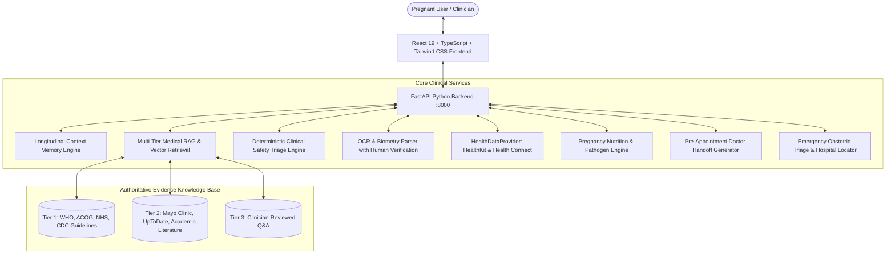

# MOMENT — Personalized Evidence-Grounded AI Pregnancy Companion

> **"An AI pregnancy companion that remembers the pregnancy journey, uses trusted medical evidence, tracks care/medications/health data, and safely connects the user to professional care when needed."**

---

## 🌟 Product Positioning & Key Differentiator

**MOMENT is NOT a generic pregnancy chatbot.**

Most generic AI assistants suffer from three catastrophic flaws in maternal health:
1. **Amnesia:** Every session is treated as a clean slate. If a patient was diagnosed with gestational hypertension at week 27, prescribed Labetalol at week 28, and experiences a frontal headache at week 31, generic AI treats the headache in isolation rather than synthesizing the maternal hypertensive context.
2. **Hallucination & Open-Web Risks:** Generic LLMs pull uncritically from unverified internet forums (e.g. Reddit, BabyCenter), confusing community anecdotes with authoritative clinical consensus.
3. **Dangerous Medical Overreach:** Generic chatbots attempt to diagnose or inappropriately suggest altering prescription dosages.

### **The MOMENT Solution:**
MOMENT maintains a persistent, structured **Longitudinal Pregnancy Context Memory** combined with:
- **Multi-Tier RAG Medical Knowledge Base** (Tier 1: WHO, ACOG, NHS, CDC).
- **Deterministic Clinical Safety Triage Engine** (ACOG Practice Bulletins #222 & #171 for Preterm Labor, Preeclampsia Severe Features, and Vaginal Bleeding).
- **Human-in-the-Loop OCR Report Parser** with mandatory verification prompt before saving.
- **Clinician-Supervised Medication Tracker** with strict safety refusal to alter dosages.
- **Wearable Health Integration** (Apple HealthKit / Android Health Connect adapter).
- **Pregnancy Food Safety Checker** evaluating pathogen vectors (*Listeria, Salmonella, Toxoplasma, Methylmercury*).
- **"Since Your Last Visit" Clinical Doctor Summary** enabling seamless obstetric handoff.
- **Emergency Care & 24/7 Maternity Triage Locator** with 1-click 911/doctor dialing and emergency directions.

---

## 🏛️ System Architecture



---

## 🔬 Deterministic Safety & Triage Engine (No LLM-Only Emergency Decisions)

MOMENT implements a **three-tier safety classification**:

| Safety Level | Clinical Action Guidance | Protocol Source |
| :--- | :--- | :--- |
| <span style="color:#059669">**GREEN**</span> | Normal physiological third-trimester symptom; comfort measures & routine monitoring. | WHO Antenatal Care Recommendations |
| <span style="color:#D97706">**YELLOW**</span> | Non-acute symptom requiring clinical communication within 12–24 hours (e.g. mild tension headache, suspected UTI). | CDC 'Hear Her' Campaign & NHS Pathways |
| <span style="color:#DC2626">**RED**</span> | **Urgent emergency obstetric evaluation required.** Triggers instant emergency care modal, 1-click doctor/hospital triage call, and navigation. | ACOG PB #171 (Preterm Labor) & ACOG PB #222 (Preeclampsia) |

---

## 🚀 3–5 Minute Killer Demo Flow for Judges

To experience the primary 15-feature workflow, click **"Judge Demo Tour"** in the top navigation bar, or run through these steps:

1. **Dashboard Overview:** Observe Sarah Jenkins at **Week 31 + 2d** (Due Dec 12, 2026), managing mild gestational hypertension with Labetalol 100mg BID.
2. **Preterm Contractions Query:** Click "Ask AI Assistant" and submit:
   > *"I'm 31 weeks pregnant. I've been having contractions every 8 minutes for the last hour."*
3. **Safety Engine Escalation:** Observe the **RED Urgency Banner**, ACOG Practice Bulletin #171 citation, and the "Launch Emergency Pathway" action.
4. **Emergency Care Center:** See 1-click buttons:
   - Call 911 Emergency Services
   - Call Dr. Elena Rostova (+1-555-019-4400)
   - Call St. Jude Labor & Delivery Triage (+1-555-019-4411)
   - Nearby Maternity Hospitals map with Level III status and turn-by-turn directions.
5. **One-Click Clinical Doctor Summary:** Open the **"Since Your Last Visit"** brief. Review the structured summary of symptoms, 94% medication adherence (1 missed aspirin dose), vitals trends, and editable questions for Dr. Rostova.
6. **Longitudinal Memory Verification:** Ask AI: *"Why are my feet and ankles slightly swollen in the evening?"* The AI synthesizes her Week 28 baseline and hypertensive condition rather than treating her as a stranger.
7. **Medication Dosage Guardrail:** Ask: *"Should I increase my Labetalol dose because my BP was 134/84?"* MOMENT strictly refuses to alter dosage, upholding medical ethics.
8. **OCR Report Parser:** In "Upload Medical Report", test the Week 28 Growth Ultrasound. Note the mandatory safety step:
   > *"We extracted the following information. Please verify before saving."*
9. **Pregnancy Food Check:** Search "Brie cheese" or "sushi". View microbiological risk breakdowns (*Listeria monocytogenes, Salmonella, Methylmercury*) with Tier 1 evidence.
10. **Wearable HealthKit Trends:** Review 7-day sleep duration, step counts, resting HR elevation, and blood pressure curves.

---

## 🛠️ Local Development & Running

### 1. Prerequisites
- Python 3.10+
- Node.js 18+

### 2. Environment Configuration
Create a `.env` file in the `backend/` directory (see `backend/.env.example`):
```bash
# backend/.env
GEMINI_API_KEY=your_gemini_api_key_here
GEMINI_MODEL=gemini-3.5-flash
PORT=8000
```
> [!NOTE]
> Never commit your `.env` file containing real API keys to GitHub. The repository includes `.gitignore` rules to protect credentials.

### 3. Quick Start (Windows PowerShell)
```powershell
.\run_moment.ps1
```

Or manually in two terminals:

#### Backend:
```bash
cd backend
pip install -r requirements.txt
python -m uvicorn main:app --host 127.0.0.1 --port 8000 --reload
```
API Documentation will be live at `http://127.0.0.1:8000/docs`.

#### Frontend:
```bash
cd frontend
npm install
npm run dev
```
Web application will be live at `http://localhost:5173`.

---

## ☁️ Deployment (Railway / Cloud)

### Backend Deployment (Railway / Render / Fly.io)
1. Link your GitHub repository in **Railway**.
2. Set the Root Directory to `/` or `/backend`.
3. Add the following **Environment Variables** in the Railway dashboard:
   - `GEMINI_API_KEY`: Your Google Gemini API Key
   - `GEMINI_MODEL`: `gemini-3.5-flash`
   - `PORT`: (Auto-assigned by Railway)
4. Start command (if deploying from root): `uvicorn backend.main:app --host 0.0.0.0 --port $PORT`

### Frontend Deployment (Vercel / Netlify / Railway)
1. Link the frontend directory to **Vercel** or **Netlify**.
2. Build Command: `npm run build`
3. Output Directory: `dist`
4. Set Environment Variable:
   - `VITE_API_URL`: Your deployed backend URL (e.g. `https://moment-backend-production.up.railway.app`)
